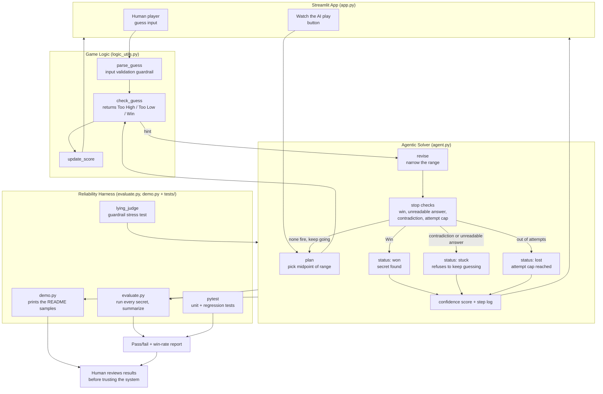

# Guessing Game with an Agentic Auto-Solver

A number-guessing game that a person can play, plus an AI agent that can play the
same game on its own. The agent plans each guess, reads the hint the game gives
back, narrows its range, and checks that the narrowed range is still possible
until it wins. A reliability harness runs the agent across every possible secret
number and reports how it did.

## Base project (Module 1)

This builds on my Module 1 project, the "Game Glitch Investigator." That was a
debugging exercise: an AI had written a Streamlit number-guessing game that was
full of bugs (the secret number reset on every submit, the higher/lower hints
were backwards, and the scoring was wrong). My job was to find the bugs, fix the
logic, refactor it into a testable module, and cover it with pytest. This project
takes that fixed game and adds an AI system on top of it.

## What the AI feature is

The centerpiece is an **agentic workflow**. Instead of a person typing guesses,
`GuessingAgent` runs a plan / act / observe / revise / check loop:

1. **Plan** a guess (the midpoint of the range it still thinks is possible).
2. **Act** by submitting that guess to the game logic.
3. **Observe** the hint (Too High, Too Low, or Win).
4. **Revise** the range so it only holds numbers the hint allows.
5. **Check** the new range. If it has collapsed, the hints can't all be true at
   once, so it stops instead of guessing forever.

The check comes after the revise on purpose: it is a test on the narrowed range,
so it has to run once the newest hint has already been applied.

There are three ways the agent stops short of a win, not one. The range can
collapse, which means the hints contradict each other. The game can answer with
something that isn't Too High, Too Low, or Win, which the agent can't act on at
all, so it refuses to guess blind. Or it can run out of attempts: the cap is
always set, defaulting to the number of guesses the range actually needs, so
there is no way to construct an agent that runs forever.

This is fully wired into the app. The "Watch the AI play" button in `app.py`
runs the agent against the current round and shows every step, so the AI feature
actually drives the game rather than sitting off to the side.

The agent's reasoning traces are saved in [ai_interactions.md](ai_interactions.md).

## Architecture overview

The source is in [diagrams/architecture.mmd](diagrams/architecture.mmd), and it
renders inline here:



A rendered image of the same diagram is at
[assets/architecture.png](assets/architecture.png).

The system has four parts:

- **Streamlit app (`app.py`)** is the interface. A person can play by hand, or
  hand the round to the agent.
- **Game logic (`logic_utils.py`)** is the pure, testable core: it parses input,
  judges a guess (Too High / Too Low / Win), and updates the score. `parse_guess`
  is the input guardrail that rejects anything that isn't a number.
- **Agent (`agent.py`)** is the reasoning loop. It only ever talks to the game
  through `check_guess`, so it's decoupled from the UI. It keeps a step log and a
  confidence score, and it has a consistency guardrail that catches a game that
  gives dishonest hints.
- **Reliability harness (`evaluate.py`, `demo.py` and `tests/`)** is where the results get
  checked. `evaluate.py` runs the agent on every secret number in each difficulty
  and prints a summary, and it stress-tests the guardrail against a game that
  deliberately lies. The pytest suite covers the game logic and the agent.

Data flows input to process to output like this: a guess (from a human or the
agent) goes into the game logic, the logic returns a hint, the agent uses that
hint to revise its range, and the harness plus pytest sit at the end to confirm
the whole thing behaves before I trust it.

## Setup

```
python3 -m venv .venv
source .venv/bin/activate
python3 -m pip install -r requirements.txt
```

Play the game:

```
python3 -m streamlit run app.py
```

Run the reliability harness:

```
python3 evaluate.py
```

Run the tests:

```
python3 -m pytest
```

## Sample interactions

All three of these print when you run:

```
python3 demo.py
```

The blocks below are that command's output, split up so I can explain each part.

### 1. The agent solves a normal round (secret = 63)

```
$ python3 demo.py
1. The agent solves a normal round

secret = 63, range 1-100
  attempt 1: guessed  50 -> Too Low   range now 51-100 confidence 0.51
  attempt 2: guessed  75 -> Too High  range now 51-74  confidence 0.77
  attempt 3: guessed  62 -> Too Low   range now 63-74  confidence 0.89
  attempt 4: guessed  68 -> Too High  range now 63-67  confidence 0.96
  attempt 5: guessed  65 -> Too High  range now 63-64  confidence 0.99
  attempt 6: guessed  63 -> Win       range now 63-64  confidence 1.0
status: won
```

The range shrinks by about half each turn and confidence climbs toward 1.0 as
fewer numbers are left.

### 2. The guardrail catches a game that lies (secret = 42)

This is the same failure mode as the original backwards-hint bug. The judge flips
every hint, so the agent gets pushed the wrong way until its range collapses.

```
2. The guardrail catches a game that lies

lying game, secret = 42
  attempt 1: guessed  50 -> Too Low   range now 51-100
  attempt 2: guessed  75 -> Too Low   range now 76-100
  attempt 3: guessed  88 -> Too Low   range now 89-100
  attempt 4: guessed  94 -> Too Low   range now 95-100
  attempt 5: guessed  97 -> Too Low   range now 98-100
  attempt 6: guessed  99 -> Too Low   range now 100-100
  attempt 7: guessed 100 -> Too Low   range now 101-100  hints contradict each other, stopping
status: stuck
```

Instead of looping forever, the agent notices the low bound has passed the high
bound (which is impossible if the hints are honest) and stops with a "stuck"
status.

### 3. Bad human input is rejected

Typing something that isn't a number doesn't crash the game. `parse_guess`
returns an error message and the game asks again:

```
3. Bad input is rejected before it reaches the game

parse_guess("")        -> (False, None, 'Enter a guess.')
parse_guess("abc")     -> (False, None, 'That is not a number.')
parse_guess("42")      -> (True, 42, None)
parse_guess("42.9")    -> (True, 42, None)
```

## Design decisions

- **Binary search instead of an LLM.** I made the agent reason with binary search
  rather than call a language model. The trade-off is that it can't handle open
  ended tasks, but for this game it is provably optimal, fully deterministic, and
  anyone can run it with no API key. For a graded project that has to be
  reproducible, that mattered more than using a bigger model.
- **The agent talks to the game only through `check_guess`.** Keeping the agent
  decoupled from the UI is what let me stress-test it against a lying judge in
  `evaluate.py` without touching the app.
- **The guardrail reuses the original bug.** The most interesting failure in the
  Module 1 project was the backwards hints. I turned that into the guardrail test:
  a game that lies is exactly a game whose hints contradict each other, and the
  agent should refuse to trust it.
- **Confidence is "how much of the range is ruled out."** It's a simple, honest
  measure. It isn't a probability from a model, and I didn't want to pretend it
  was.

## Testing summary

All 30 tests pass and the reliability harness passes all 4 of its checks.

The harness plays 320 honest games (every secret from 1 to 20, 1 to 100, and 1 to
200) and the agent wins every one. Average attempts were 3.7 on Easy, 5.8 on
Normal, and 6.8 on Hard, and the worst case on each difficulty came out exactly
equal to the binary-search bound, so it isn't just winning, it's winning as fast
as the math allows. The guardrail sweep ran the lying game against all 100 Normal
secrets and the agent caught 99 of them. The only miss is the number it guesses
first, where it wins before the game ever gets to lie.

Two tests came out of a bug I found late: the per-difficulty attempt limits were
hand-picked numbers, and Normal and Hard were unwinnable even with perfect play.
Both limits now come from the range size, and the tests check that every
difficulty is actually winnable and that what shrinks with difficulty is the
headroom above the minimum, not the number of guesses.

What I learned: the agent is only as trustworthy as the hints it's given, so the
consistency check turned out to be the most important part. Without it, a broken
game would send the agent into a dead end and it would keep guessing anyway.

Full output is in the section below.

## Reproducible execution evidence

### `pytest`

```
$ python3 -m pytest
============================= test session starts ==============================
platform darwin -- Python 3.9.6, pytest-8.4.2, pluggy-1.6.0
rootdir: /Users/sufiyanrauf/Desktop/applied-ai-system-project
configfile: pytest.ini
testpaths: tests
collected 30 items

tests/test_agent.py ............                                         [ 40%]
tests/test_game_logic.py ..................                              [100%]

============================== 30 passed in 0.02s ==============================
```

### `python3 evaluate.py`

```
$ python3 evaluate.py
=======================================================
Guessing Agent - Reliability Report
=======================================================
Difficulty: Easy  (range 1-20)
  Games played:     20
  Wins:             20/20
  Avg attempts:     3.70
  Worst attempts:   5 (theoretical cap 5)
  Avg confidence:   1.00

Difficulty: Normal  (range 1-100)
  Games played:     100
  Wins:             100/100
  Avg attempts:     5.80
  Worst attempts:   7 (theoretical cap 7)
  Avg confidence:   1.00

Difficulty: Hard  (range 1-200)
  Games played:     200
  Wins:             200/200
  Avg attempts:     6.76
  Worst attempts:   8 (theoretical cap 8)
  Avg confidence:   1.00

Guardrail sweep: agent vs. a game that lies on every hint
  Range:            1-100
  Caught (stuck):   99/100
  Won anyway:       [50]
  Why:              50 is the agent's first guess, so it
                    wins before the liar ever gets to flip a hint

=======================================================
Summary: 4/4 checks passed
The agent solves every honest game and stops on every lie it sees.
=======================================================
```

## Portfolio

Repo: https://github.com/SufiyanRauf/applied-ai-system-project

**What this project says about me as an AI engineer**

This project says I care more about whether a system can be trusted than whether
it looks impressive. I could have wired an API call into the game and called it an
AI project. Instead I built an agent that reasons through a plan, act, observe,
revise, check loop, and then spent most of my time on the part that decides when
to stop. The guardrail came out of a bug in my own earlier work, where the game's
hints contradicted each other, and I turned that failure into the test the agent
has to pass. Then I made it prove itself across all 320 possible games instead of
the single round I would have demoed. The habit I took from it is the one I want
to bring to real work: an agent is only as reliable as the feedback it is given,
so I build the thing that checks the feedback before I trust the output.

## Reflection and ethics

The main thing this project taught me is that the hard part of an AI system is
not getting it to work, it is knowing when to stop trusting it. Binary search was
the easy piece. What I kept coming back to was what the agent should do when the
feedback it gets is wrong, because a loop that can't recognize bad input will keep
running and still look confident while it does. It also changed how I test: instead
of trying one number and calling it good, I built the harness and made the agent
prove itself on every case it could ever see.

The graded reflection (how I worked with AI, one helpful and one flawed AI
suggestion, limitations, bias, and misuse) is in
[model_card.md](model_card.md). My earlier debugging write-up from Module 1 is in
[reflection.md](reflection.md).
